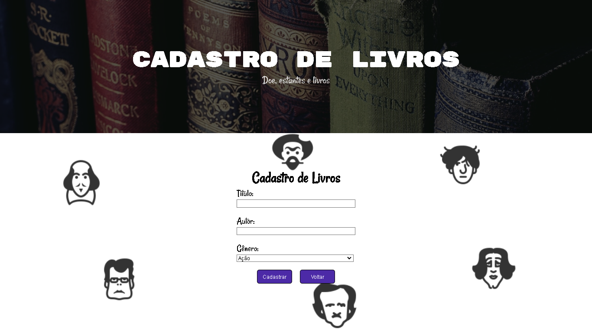
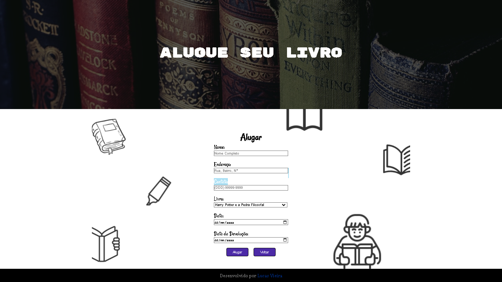

# Biblioteca da Comunidade
Sistema de cadastro e aluguel de livros. Cada livro que é doado, é cadastrado em um banco de dados e assim disponibilizado para alguém alugar.

## Sobre o projeto
Este projeto foi desenvolvido com os conhecimentos que adquiri em HTML, CSS, Javascript, NodeJS, Express, MySql e Body Parser. 
Foi utilizado também o Consolidate e swig para configuração do template para HTML e assim ser possível enviar dados para o Front-End.

Os conhecimentos em Front-End adquiri com o curso da [Rocketseat](https://www.rocketseat.com.br/) e [CursoEmVideo](https://www.cursoemvideo.com/)  
Os conhecimentos de Back-End adquiri assistindo o curso do [Victor Lima - Guia do Programador](https://www.youtube.com/channel/UC_issB-37g9lwfAA37fy2Tg)

## Imagens do projeto

  
  
  

## Tecnologias Utilizadas
  * HTML
  * CSS
  * Javascript
  * NodeJS
  * Express
  * Sequelize
  * MySql
  * Body Parser
  * Consolidate
  * Connect-Flash
  * Express-Session

## Autor
  **Lucas Vieira**  
  [LinkedIn](https://www.linkedin.com/in/lucas-vieira-dev/) 
  [E-mail](mailto:lukasveras14@gmail.com)
